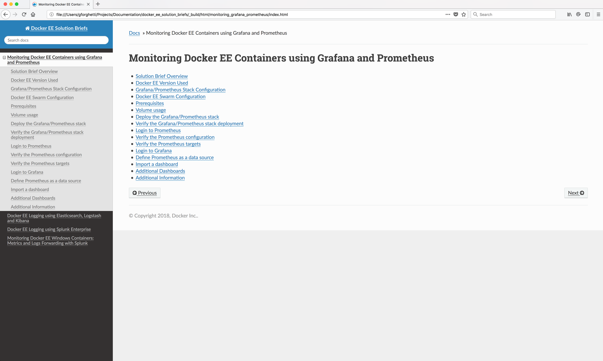

Docker EE Solution Briefs
=========================

This Github repository holds the source for Docker EE Solution Briefs which are written in [restructured text](http://www.sphinx-doc.org/en/master/rest.html).

Restructed text is a bit more feature rich than markdown, and the syntax should be relatively easy to understand.

If you're confused on how to use restructured text, anything you're likely needing to do is probably contained already in one of the Solution Briefs in this repo and you can get more info here [Sphinx](http://www.sphinx-doc.org/en/master/).

Using [Sphinx](http://www.sphinx-doc.org/en/master/) you can build very nice HTML or a PDF from the [restructured text](http://www.sphinx-doc.org/en/master/rest.html).

### This Repo's Hierarchy 

Each Solution Brief is contained in a separate directory.

You can build HTML for all of the Solution Briefs combined, or you can change into the directory of a specific Solution Brief and just build the HTML for that Solution Brief.

### Prerequisites

You will need [Sphinx](http://www.sphinx-doc.org/en/master/) and the Sphinx [sphinx_rtd_theme](https://pypi.python.org/pypi/sphinx_rtd_theme) HTML theme in order to build and view the HTML generated from the Restructed text. 

### Install Sphinx

You can install Sphinx and the **sphinx_rtd_theme** HTML theme using python pip. If you do not have pip you can download and install it from here: [pip](https://pip.pypa.io/en/stable/installing/).

```bash
pip install sphinx
pip install sphinx_rtd_theme
```

To verify that Sphinx is installed and ready to use issue the command:
```bash
sphinx-build --version
```

Response:
```
sphinx-build 1.7.1
```

### Building/Testing HTML

1. Clone this repo.

2. You can build this content using ``make clean && make html``.

3. To view the output open the file ``_build/html/index.html`` from a Web browser.

### Sample HTML output



### Building/Testing PDF Output

It is possible to make a PDF. This requires you to install the [LaTex](https://www.latex-project.org/get/) product. You can download LaTex here: https://www.latex-project.org/get/

Note: The PDF will wrap *long* commands/definitions and place a *continuation* character on the each continued line which will affect copy/paste of those items. You will need to manually remove the *continuation* character after the paste. Because of this I recommend using the HTML output which also allows you to download docker-compose.yml files and configuration files directly from the HTML.

To build a PDF issue the command: ``make clean && make latexpdf``.

The PDF file will be placed in the `_builds/latex` directory.

### Adding your own Solution Brief to this repo

**Note: Do not modify anything in the `common` directory of this repo unless you know what you are doing and have a good reason to do so.  It contains common definitions shared by all Solution Briefs so that all share the same HTML theme, look and feel.**

To add your own Solution Brief to this repo:

1. Create a new directory in the base location of this repo and name the directory appropriately.

   ```bash
   mkdir logging_xyz_product
   ```

2. Copy the Sample Solution Brief directory ./sample_solution_brief to your directory. It contains a simple start up.

    ```bash
    cp -r ./sample_solution_brief/* ./logging_xyz_product
    ```

3. Change directory into your directory

    ```bash
    cd ./logging_xyz_product
    ```
You are now ready to go.

This is the link to a reference for Sphinx [restructured text](http://www.sphinx-doc.org/en/master/rest.html).

4. You can build HTML by running this command:

    ```bash
    make clean && make html
    ```

5. The html will be in the _build/html directory

6. Open the file ~build/html/index.html to see your HTML   

### Build a PDF from from your Solution Brief 

7. If you want to include your Solution Brief in with the entire build:

    * Edit the file ./index.rst in the base directory of this repo. **Be Careful!**
    * Append your entry to the end. Assuming your directory is `logging_xyz_product` add this: `logging_xyz_product/index`.
      
    **./index.rst before:**

    ```
    ..  _docker_ee_solution_briefs:

    Docker EE Solution Briefs
    =============================

    Docker EE Solution Briefs

    ..  toctree::
        :titlesonly:
        :maxdepth: 1

        monitoring_grafana_prometheus/index
        logging_elk/index
        logging_splunk/index
        monitoring_splunk_windows_containers_and_logs/index
        
    ```

    **./index.rst after:**

    ```
    ..  _docker_ee_solution_briefs:

    Docker EE Solution Briefs
    =============================

    Docker EE Solution Briefs

    ..  toctree::
        :titlesonly:
        :maxdepth: 1

        monitoring_grafana_prometheus/index
        logging_elk/index
        logging_splunk/index
        monitoring_splunk_windows_containers_and_logs/index
        logging_xyz_product/index

    ```
8. Then build the HTML from the base directory of the repo and make sure it builds without errors.

    ```bash
    make clean && make html
    ```

There is a Sphinx configuration file in your directory named **conf.py**.

It includes the **./common/config.py** file which contains the base configuration shared by all Solution Briefs.

Do not modify the  **./common/config.py** file in this repo as it is shared by every Solution Brief and contains definitions so all of the Solution Briefs look the same when formatted to HTML or PDFs.

You should not need to modify the **conf.py** file in your own directory unless you want to build a PDF.
 
In that cased edit the **conf.py** file in your directory:
   
   * Change `Sample_Solution_Brief` to a filename to match your Solution Brief. This name will be used to generate the PDF file name. Don't remove or change the `.tex` file extension!
   * Change `Sample Solution Brief` to a descriptive name for your Solution Brief. This name will be used to generate the Header page in your PDF.

Sample **conf.py** (before you edit it)

```text
   latex_documents = [
    (master_doc, 'Sample_Solution_Brief.tex', u'Sample Solution Brief',
     u'Gary Forghetti', 'manual'),
   ]
``` 


Then to make a PDF inside your directory for your Solution Brief:

```bash
   make clean && make html
```


The PDF will be in the `_builds/latex` directory inside your Solution Brief directory.   

Any questions, contact me.

Gary Forghetti\
Business Development\
Docker, Inc.
