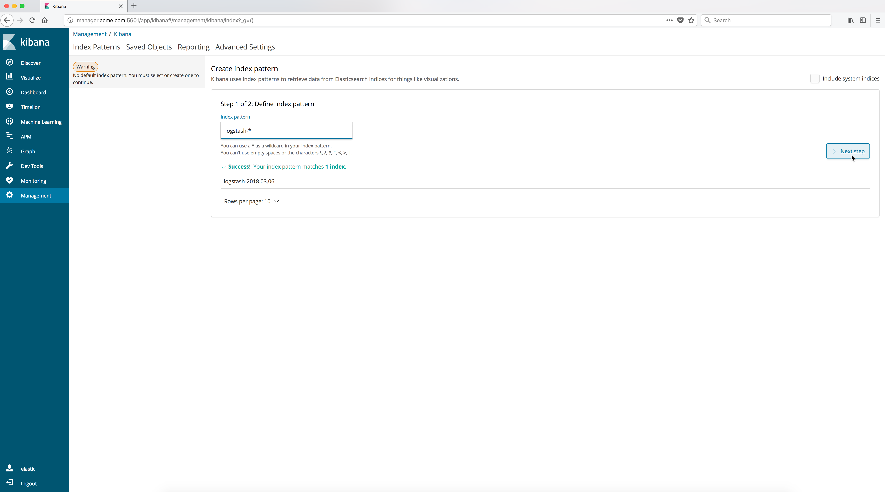

..  _elk_create_index_pattern1:

..  raw:: latex

    \newpage

Create index pattern - Step 1
=============================

A Logstash **Index** should appear once the logging data is received by Logstash.
Specify the ``wildcard`` index pattern **logstash-*** in the **Index pattern** input field. You should see the **Success** message. 

Then click on the **Next step** button.

..  toctree::
    :hidden:
    :titlesonly:
    :maxdepth: 1
    