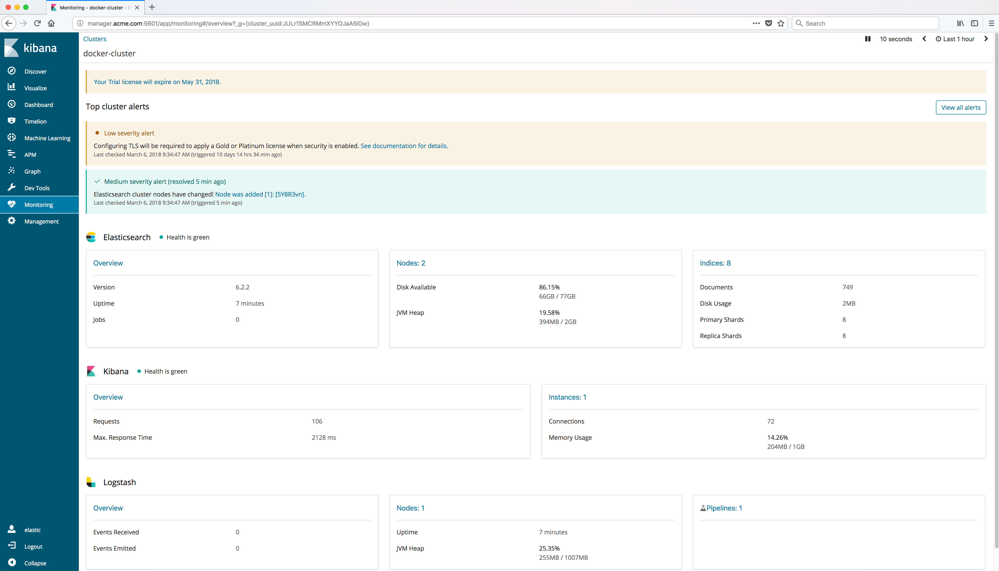

..  _elk_monitoring:

Elastic Monitoring
==================

The Elastic docker images contain `X-Pack <https://www.elastic.co/guide/en/x-pack/current/xpack-introduction.html>`_ and are configured with built in monitoring of the
Elasticsearch, Logstash and Kibana services. Click on the **Monitoring** item in the left frame to display the Monitoring.

Example Screen:

..  toctree::
    :hidden:
    :titlesonly:
    :maxdepth: 1     
