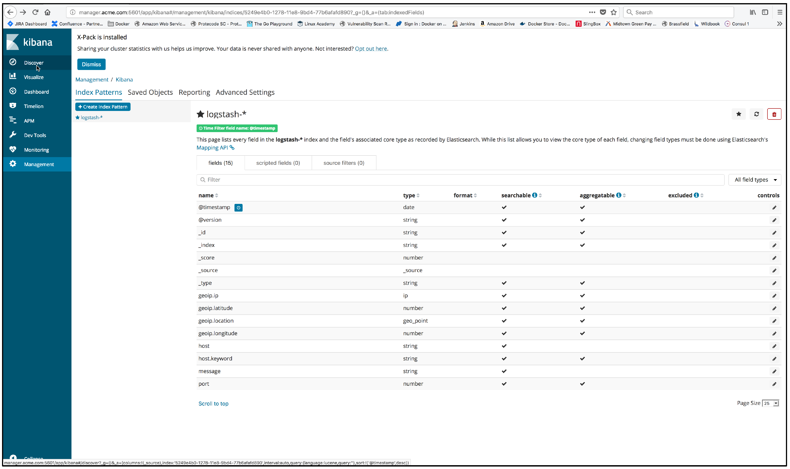

..  _elk_index_pattern_created:

..  raw:: latex

    \newpage

Index pattern created
=====================

The index pattern is created and shows all fields recorded with the **logstash-*** index.

Click on the **Discover** item in the left frame to display the log data.

..  toctree::
    :hidden:
    :titlesonly:
    :maxdepth: 1  
    