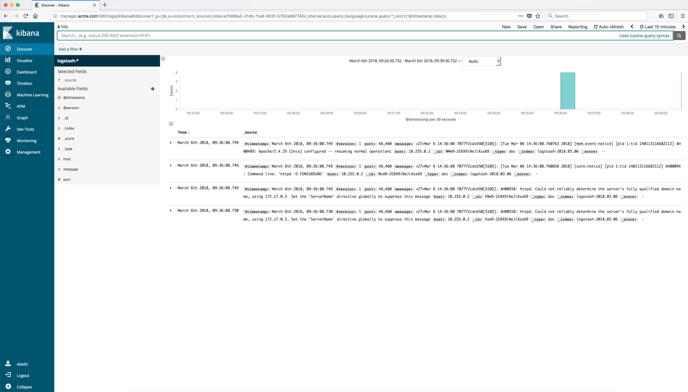

..  _elk_log_data_displayed:

..  raw:: latex

    \newpage

Log Data
========

You should see the Log data from the Docker Apache HTTP server container.

..  toctree::
    :hidden:
    :titlesonly:
    :maxdepth: 1  