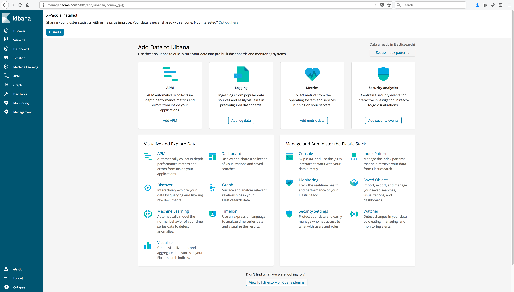

..  _elk_logged_in_to_kibana:

..  raw:: latex

    \newpage

Logged in to Kibana
===================

You should now be successfully logged in to Kibana.

Example Screen:

..  toctree::
    :hidden:
    :titlesonly:
    :maxdepth: 1  
