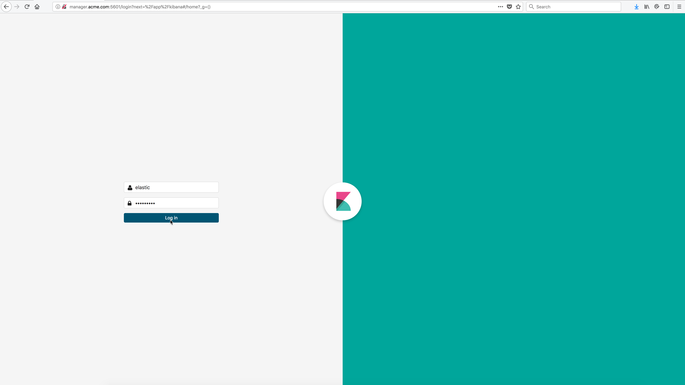

..  _elk_login_to_kibana:

Login to Kibana
===============

Bring up a web browser and login to the Kibana server. 

Substitute ``docker-node-name`` in the URL below with the hostname of any of the docker nodes running in the swarm.

    ``http://docker-node-name:5601``

You will be prompted for the Elastic user and password which was specified in the :ref:`docker-compose.yml<elk_docker_compose_yml>` file in the environment for the Elasticsearch service.    

Example Screen:

..  toctree::
    :hidden:
    :titlesonly:
    :maxdepth: 1  

    logged_in_to_kibana  
