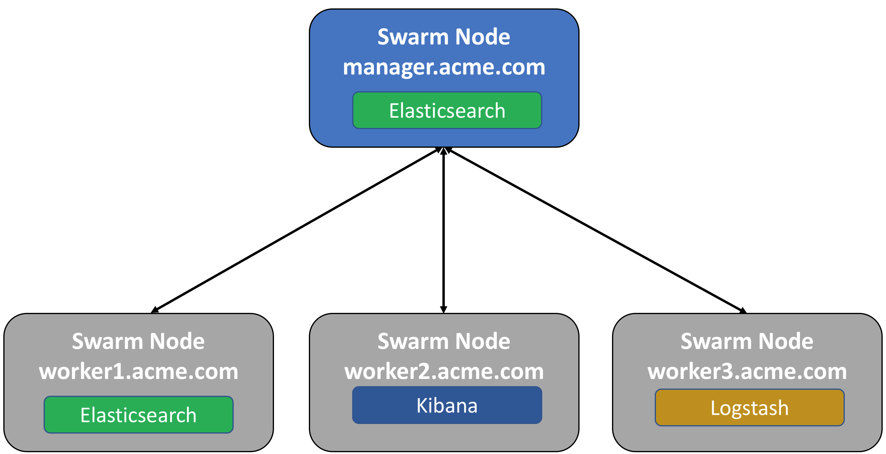

..  _elk_swarm_configuration:

Docker EE Swarm Configuration
=============================

An Elasticsearch, Logstash and Kibana stack will be deployed to the following 3 node Docker Swarm.

An example will be shown on how to use the `Docker Syslog logging driver <https://docs.docker.com/config/containers/logging/syslog/>`_ to capture the logs from Docker containers and send them to the Elastic stack.

..  note:: The services can run on any of the nodes in the swarm.

..  toctree::
    :hidden:
    :titlesonly:
    :maxdepth: 1  
    
