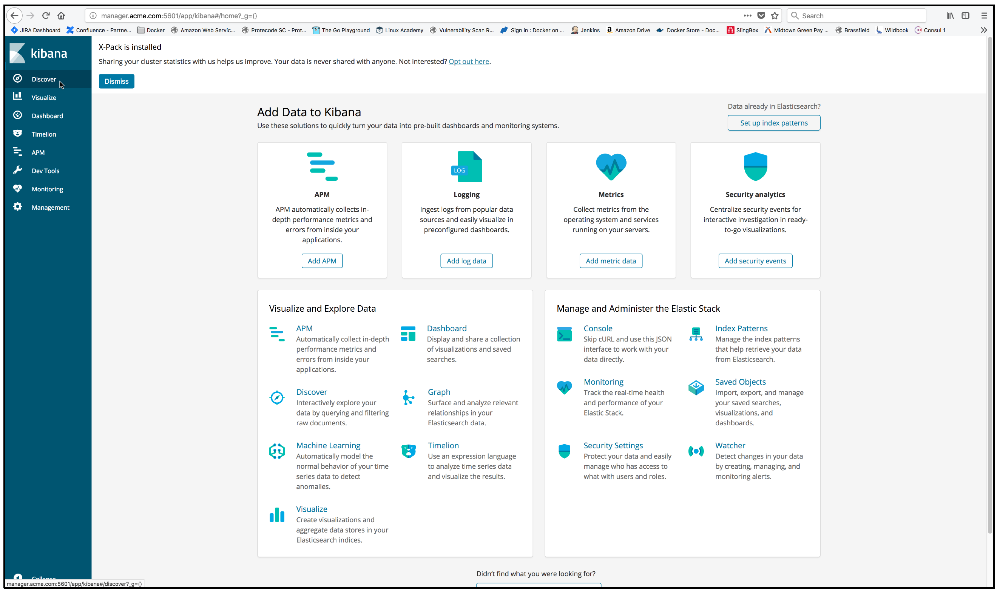

..  _elk_view_logs:

View the Docker container log data
==================================

Before you can view the log data from Kibana you must create an `index pattern <https://www.elastic.co/guide/en/kibana/current/index-patterns.html>`_.

To create an `index pattern <https://www.elastic.co/guide/en/kibana/current/index-patterns.html>`_ and view the log data, click on the **Discover** item from the left frame in the Kibana console.

..  toctree::
    :hidden:
    :titlesonly:
    :maxdepth: 1   

    create_index_pattern1
    create_index_pattern2
    index_pattern_created
    log_data_display
