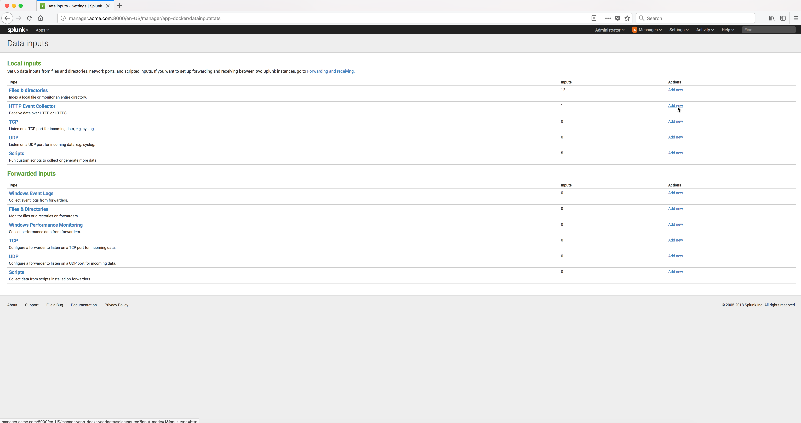

..  _splunk_create_new_http_event_collector1:

..  raw:: latex

    \newpage

Step 1
======

Click on the **Add new** link in the **HTTP Event Collector** row.

Example Screen:

..  toctree::
    :hidden:
    :titlesonly:
    :maxdepth: 1 
