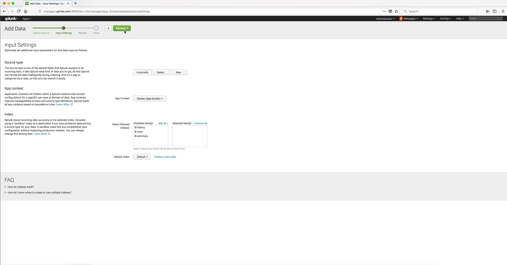

..  _splunk_create_new_http_event_collector3:

..  raw:: latex

    \newpage

Step 3
======

You can leave the defaults as is on this page.

Click on the **Review** button.

Example Screen:

..  toctree::
    :hidden:
    :titlesonly:
    :maxdepth: 1