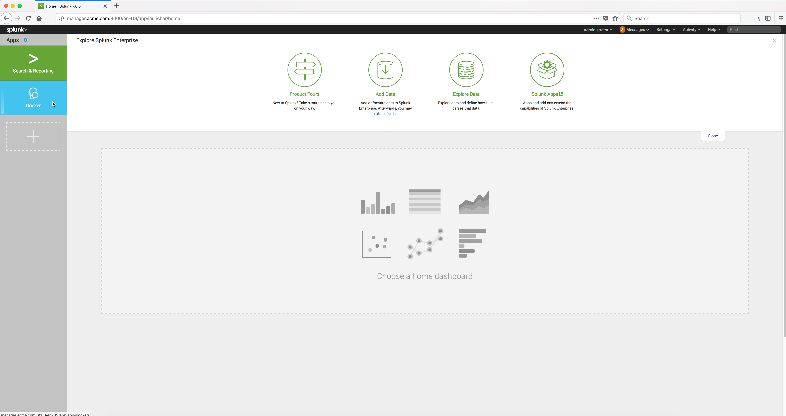

..  _splunk_docker_monitoring:

Docker Monitoring
==================

The Splunk images whose tags are suffixed with **-monitor** come with built-in Docker Monitoring. These docker images are been used this Solution Brief.

The Splunk Enterprise docker image installs the **Splunk Docker Monitoring App** which has dashboards to help you analyze collected logs and docker information such as stats, events,
tops, and inspect from your running images.

The Splunk Universal Forwarder docker image comes with the necessary data inputs activated to forward the necessary monitoring data from
remote docker nodes to the **Splunk Docker Monitoring App**.

The **Splunk Docker Monitoring App** provides the following Dashboards:

* Cluster Overview
* Docker Events
* Docker Overview
* Docker Stats
* Reassembled Log Events
* UCP Operational Dashboard

To view the **Splunk Docker Monitoring App** monitoring functions, click on the App in the left frame from the Splunk Enterprise console.

Example Screen:

..  toctree::
    :hidden:
    :titlesonly:
    :maxdepth: 1

    docker_monitoring_overview
    docker_monitoring_stats    
