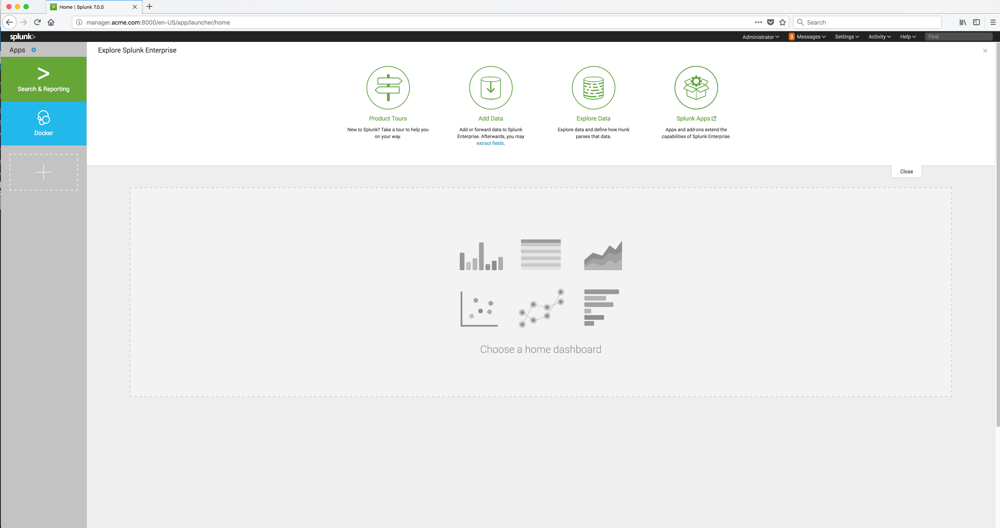

..  _splunk_logged_in_to_splunk:

..  raw:: latex

    \newpage

Logged in to Splunk
===================

You should now be successfully logged in to Splunk.

Example Screen:

..  toctree::
    :hidden:
    :titlesonly:
    :maxdepth: 1
