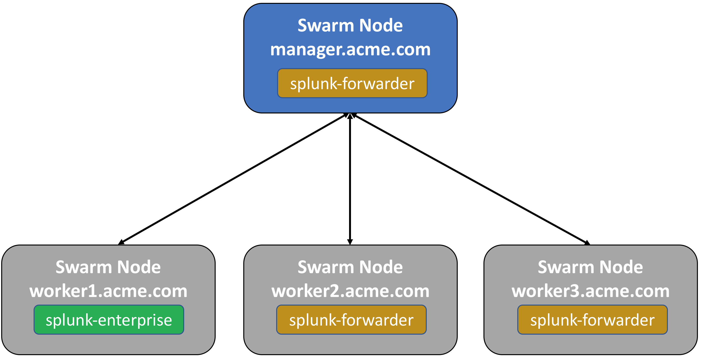

..  _splunk_swarm_configuration:

Docker EE Swarm Configuration
=============================

A Splunk stack will be deployed to the following 4 node Docker Swarm.

An example will be shown on how to use the `Docker Splunk logging driver <https://docs.docker.com/config/containers/logging/splunk/>`_ to capture the logs from Docker containers and send them to the Splunk stack.

..  toctree::
    :hidden:
    :titlesonly:
    :maxdepth: 1
