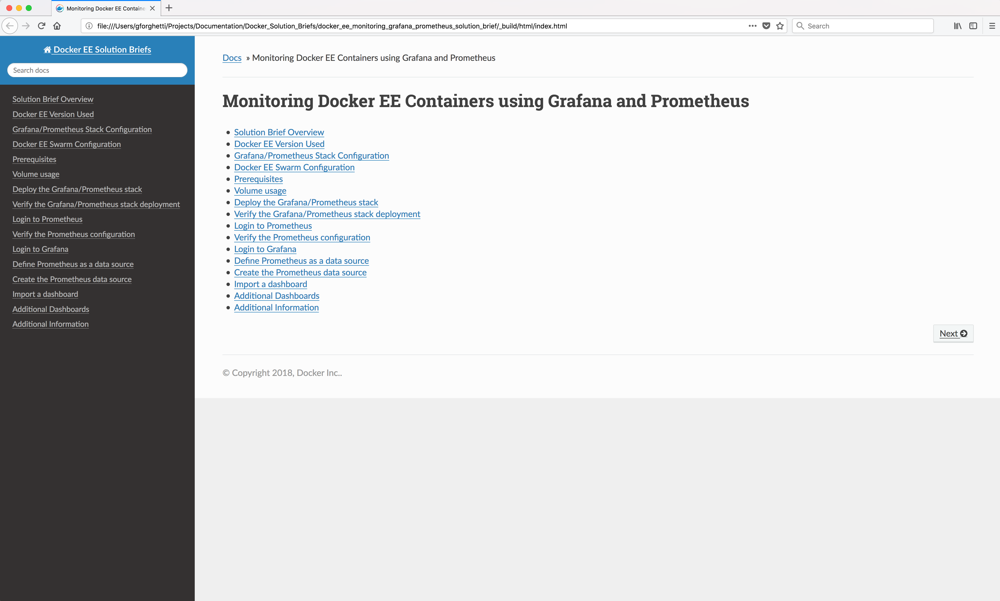

Monitoring Docker EE Containers using Grafana and Prometheus
============================================================

### RST and Sphinx

The Solution Brief is written in [restructured text](http://www.sphinx-doc.org/en/master/rest.html)

Very nice HTML can be built using [Sphinx](http://www.sphinx-doc.org/en/master/).

You can also generate [PDF Output](#pdf-output) which requires [Sphinx](http://www.sphinx-doc.org/en/master/) and the [LaTex](https://www.latex-project.org/get/) product to be installed.

Restructed text is a bit more feature rich than markdown, and the syntax should be relatively easy to understand.

If you're confused on how to use restructured text, anything you're likely needing to do is probably contained already in this Solution Brief and [Sphinx](http://www.sphinx-doc.org/en/master/).

### Prerequisites

You will need [Sphinx](http://www.sphinx-doc.org/en/master/) and the Sphinx [sphinx_rtd_theme](https://pypi.python.org/pypi/sphinx_rtd_theme) HTML theme in order to build and view the HTML generated from the Restructed text. 

### Install Sphinx

You can install Sphinx and the **sphinx_rtd_theme** HTML theme using python [pip](https://pip.pypa.io/en/stable/installing/):

```bash
pip install sphinx
pip install sphinx_rtd_theme
```

To verify that Sphinx is installed and ready to use issue the command:
```bash
sphinx-build --version
```

Response:
```
sphinx-build 1.7.1
```

### Building/Testing

1. Clone this repo.

2. You can build this content using ``make clean && make html``.

3. To view the output open the file ``_build/html/index.html`` from a Web browser.

### Sample HTML output



### PDF Output

It is possible to make a PDF. This requires you to install the [LaTex](https://www.latex-project.org/get/) product. You can download LaTex here: https://www.latex-project.org/get/

Note: The PDF will wrap *long* commands/definitions and place a *continuation* character on the each continued line which will affect copy/paste of those items. You will need to manually remove the *continuation* character after the paste. Because of this I recommend using the HTML output which also allows you to download docker-compose.yml files and configuration files directly from the HTML.

To build a PDF issue the command: ``make clean && make latexpdf``.

The PDF file will be placed in the `~builds/latex` directory.

Gary Forghetti\
Business Development\
Docker, Inc.
