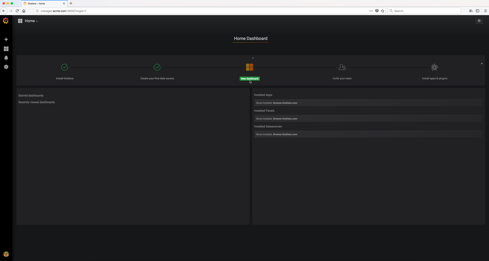
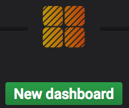

..  _grafana_prometheus_monitoring_import_dashboard:

Import a dashboard
==================

To display and visualize the Prometheus metrics data you can import a pre-defined dashboard. 

There is a simple Docker and system monitoring dashboard on Grafana that you can import into Grafana.

The web URL is ``https://grafana.com/dashboards/893``

To import that dashboard, click on the |new_dashboard_on_home_dashboard_icon| button.

Example Screen:

..  toctree::
    :hidden:
    :titlesonly:
    :maxdepth: 1  
    
    import_dashboard1
    import_dashboard2
    import_dashboard3
    import_dashboard4
    dashboard_created
