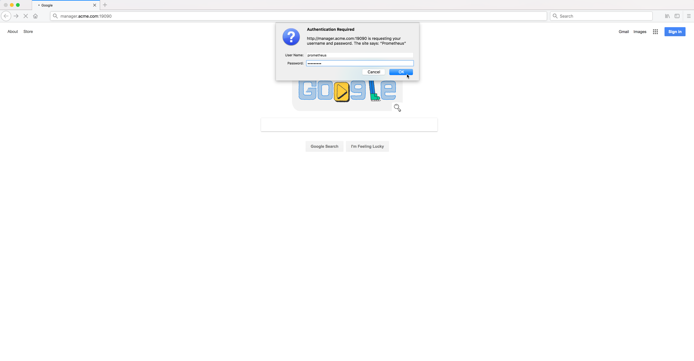

..  _grafana_prometheus_monitoring_login_to_prometheus:

Login to Prometheus
===================

Bring up a web browser and login to the Prometheus server. 

Substitute ``docker-node-name`` in the URL below with the hostname of any of the docker nodes running in the swarm.

    ``http://docker-node-name:19090``

You will be prompted for the Prometheus user and password. 

This is the user and password that you defined earlier in the :ref:`custom Nginx docker image<grafana_prometheus_monitoring_prerequisites>` with the **htpasswd** command.     

Example Screen:

..  toctree::
    :hidden:
    :titlesonly:
    :maxdepth: 1  
    
    logged_in_to_prometheus
