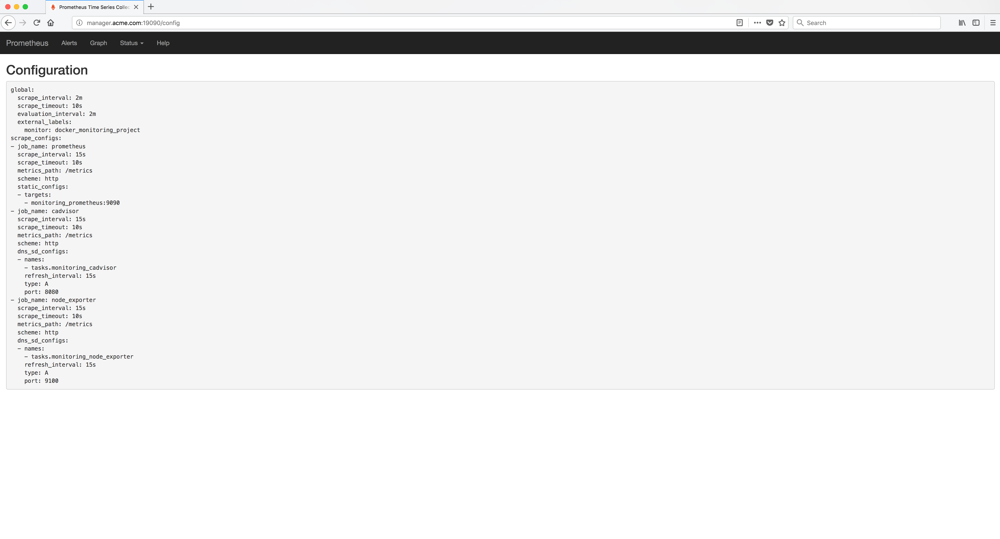

..  _grafana_prometheus_monitoring_verify_prometheus_configuration:

Verify the Prometheus configuration
===================================

From the **Status** menu, select the **Configuration** menu item. The Prometheus **Configuration** should be displayed.

Example Screen:

..  toctree::
    :hidden:
    :titlesonly:
    :maxdepth: 1  
 