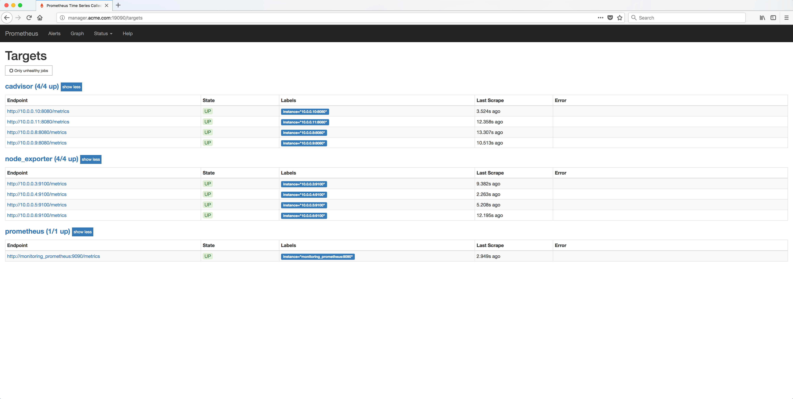

..  _grafana_prometheus_monitoring_verify_prometheus_targets:

..  raw:: latex

    \newpage

Verify the Prometheus targets
=============================

From the **Status** menu, select the **Targets** menu item. The Prometheus **Targets** should be displayed.

The **cadvisor**, **node_exporter** and **prometheus** Endpoints should all be displayed and their State should be **UP**.

Example Screen:

..  toctree::
    :hidden:
    :titlesonly:
    :maxdepth: 1  
        
