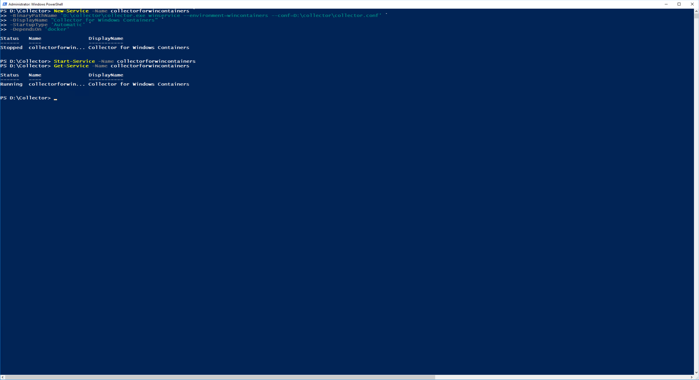

..  _splunk_install_outcold_collector_as_service:

..  raw:: latex

    \newpage

Install the Collector as a Windows Service
==========================================

If all looks good and there are no errors, stop the manually started Outcold Collector. You can stop it by the keyboard combination of ``Ctrl-C``.

Install the Outcold Collector as a Windows service. Run the following command from a Windows Powershell command prompt:

    .. code-block:: text

        New-Service -Name collectorforwincontainers `
        -BinaryPathName 'D:\collector\collector.exe winservice --environment=wincontainers --conf=D:\collector\collector.conf' `
        -DisplayName "Collector for Windows Containers" `
        -StartupType 'Automatic' `
        -DependsOn 'docker'
          

    .. note:: 
     
       | Outcold Solutions requires that the Collector service runs under the **LocalSystem** account or under another account which has the permissions to the system calls the Collector is issuing and has the permissions to access the docker file system. 
       | 
       | In their documentation they explicitly specify the ``-Credential 'LocalSystem'`` argument on the ``New-Service`` command. If you do not specify the ``-Credential 'LocalSystem'`` argument the default is the **LocalSystem** account.
       |
       | However, If you specify the ``-Credential 'LocalSystem'`` argument on the ``New-Service`` command, windows will display a dialog box prompting you for the **LocalSystem** password. 
       |
       | If you omit the ``-Credential 'LocalSystem'`` argument (as I did above), the Collector service is created and defaults to the **LocalSystem** account without the dialog box prompting you for the **LocalSystem** password. 
       |
       | I chose to omit the ``-Credential 'LocalSystem'`` argument as this allows you to automate creating the Collector service.

Start the Collector service:

    .. code-block:: text

        Start-Service -Name collectorforwincontainers

Verify that it is running:

    .. code-block:: text

        Get-Service -Name collectorforwincontainers

Example Output:

    .. code-block:: text

        Status   Name               DisplayName
        ------   ----               -----------
        Running  collectorforwin... Collector for Windows Containers

Example Screen:

     
..  toctree::
    :hidden:
    :titlesonly:
    :maxdepth: 1
