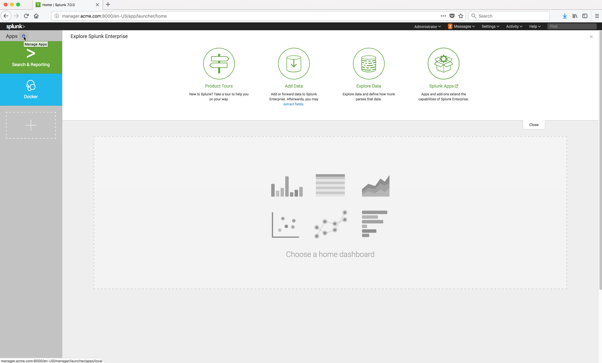

..  _splunk_install_splunk_monitoring_windows_app:

Install Splunk Monitoring Windows Container App
===============================================

From the Splunk Enterprise server console, click on the Apps |splunk_manage_apps_button_icon| icon.

Example Screen:

..  toctree::
    :hidden:
    :titlesonly:
    :maxdepth: 1

    install_splunk_monitoring_windows_app1
    install_splunk_monitoring_windows_app2
    install_splunk_monitoring_windows_app3  
    install_splunk_monitoring_windows_app4
    install_splunk_monitoring_windows_app5 
    install_splunk_monitoring_windows_app6
