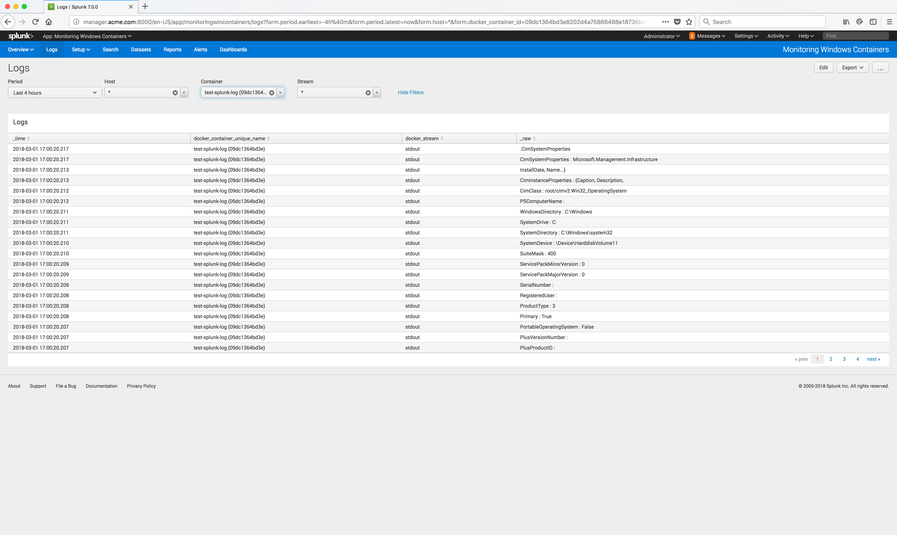

..  _splunk_view_windows_containers_logs2:

..  raw:: latex

    \newpage

View logs for all Containers on a Node
======================================

The App Monitoring Windows Containers **Logs** page is now displayed.

By default It displays the logs in descending order by time for all containers.

..  toctree::
    :hidden:
    :titlesonly:
    :maxdepth: 1
    