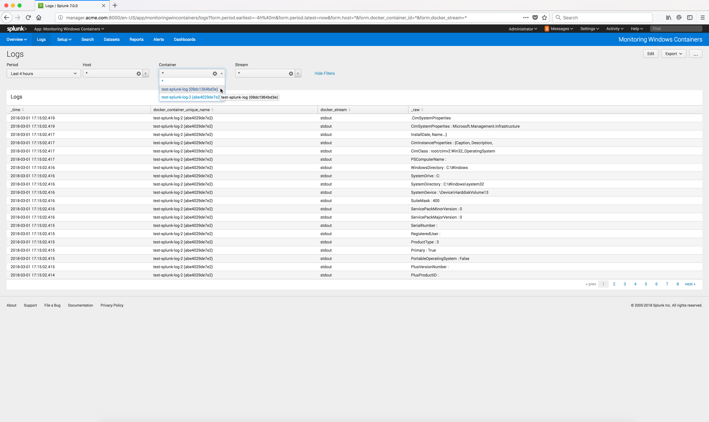
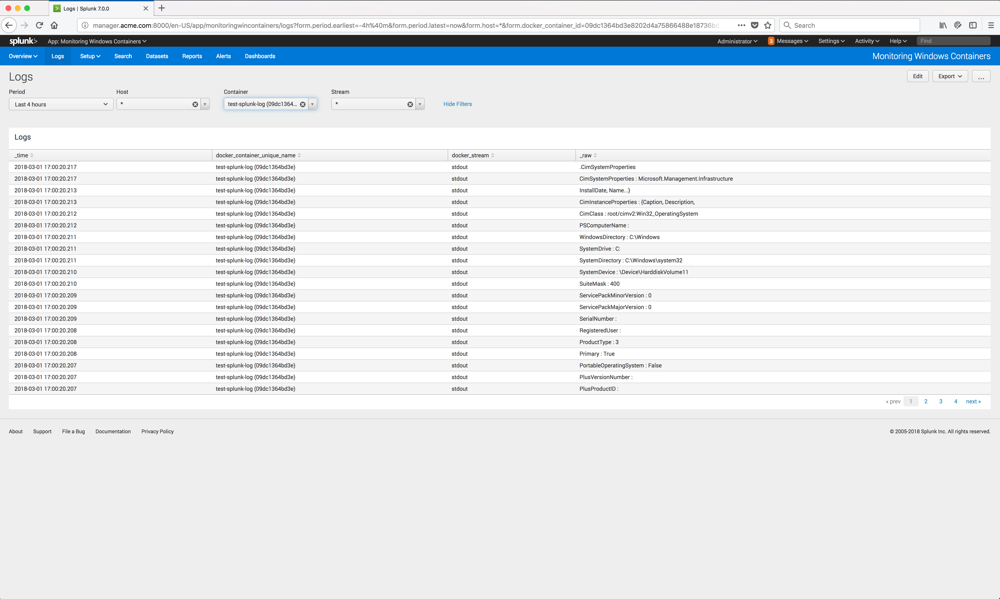

..  _splunk_view_windows_containers_logs2:

View a specific Containers Logs
================================

You can select a specific container and view the logs from that specific container.

From the App Monitoring Windows Containers **Logs** page, select the specific container from the **Container** drop dow list.

The logs from that specific container are now displayed. 

..  toctree::
    :hidden:
    :titlesonly:
    :maxdepth: 1
