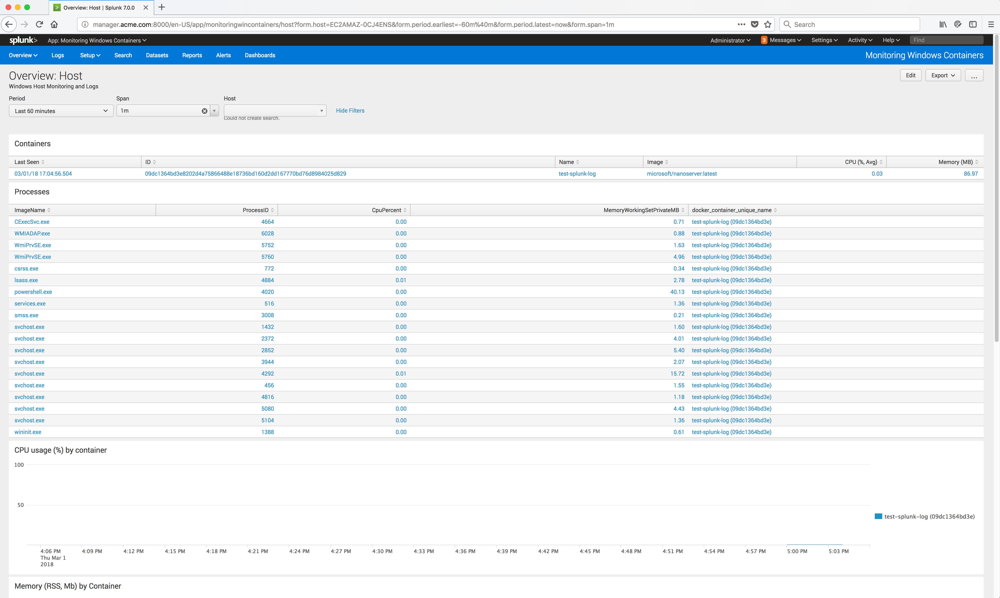
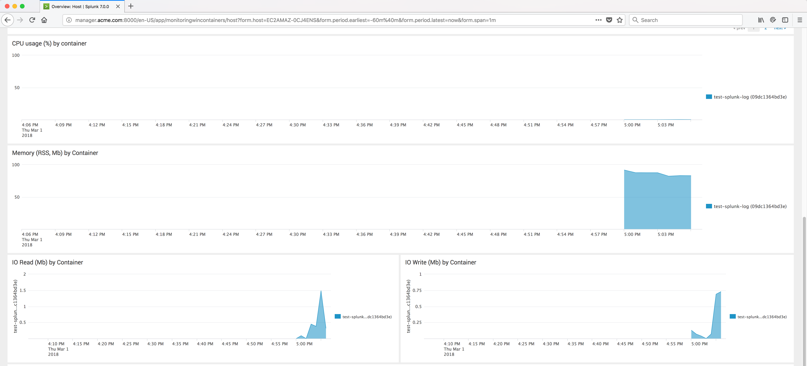

..  _splunk_view_windows_containers_metrics2:

..  raw:: latex

    \newpage

View Metrics for all Containers on a Node
=========================================

You should now see some data from the Docker Windows node where the Collector was installed.

This page shows the metrics for all windows containers running on the Docker Windows node.

You should just see the one container **test-splunk-log** that you previously launched for now.

Scrolling down you should see CPU usage, Memory by Container and IO Read.

..  toctree::
    :hidden:
    :titlesonly:
    :maxdepth: 1
    