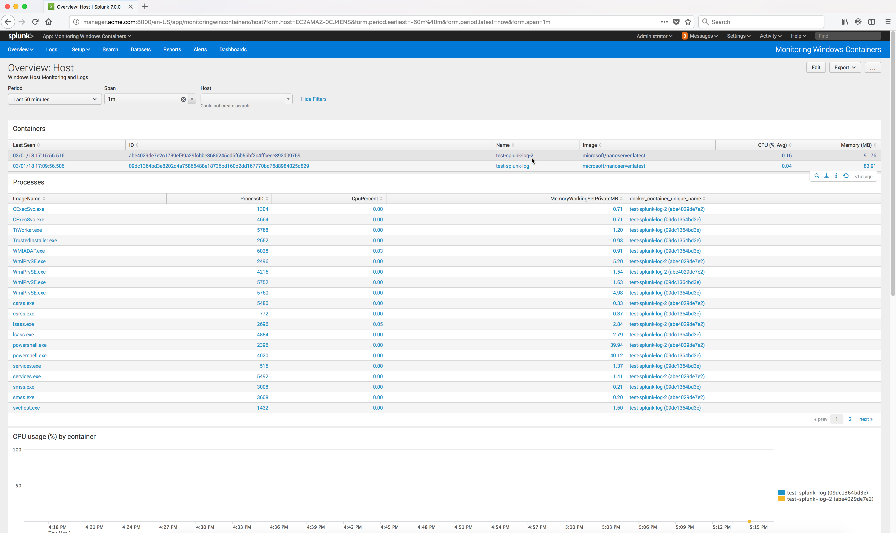
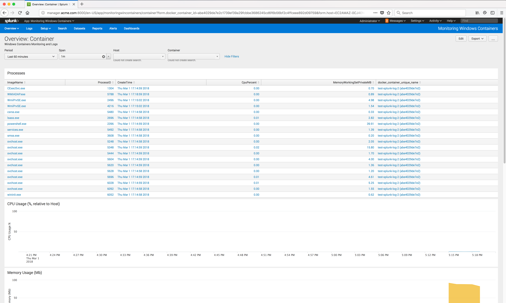

..  _splunk_view_windows_containers_metrics2:

..  raw:: latex

    \newpage

View a specific Containers Metrics
==================================

You can select a specific container and view the metrics from that specific container.

To do that run the following command to start a second Docker Windows Container named **test-splunk-log-2** from a Powershell command prompt on the Docker Windows node:

    .. code-block:: text

        docker container run -it -d --rm --name test-splunk-log-2 microsoft/nanoserver:latest `
        Powershell 'Get-CimInstance Win32_OperatingSystem | FL * ; Start-Sleep -seconds 600'

Refresh the page.

You should now see the second container **test-splunk-log-2** that you just launched.

..  note:: There might be a slight delay (20-30 seconds) before the data is available for display.

Now the **Overview: Host** page shows both containers and the Processes for both containers.

Click on the container name to view specific metrics on that container.

The **Overview:: Container** page is now displayed for the selected container and it shows just the metrics for the selected container.

..  toctree::
    :hidden:
    :titlesonly:
    :maxdepth: 1
