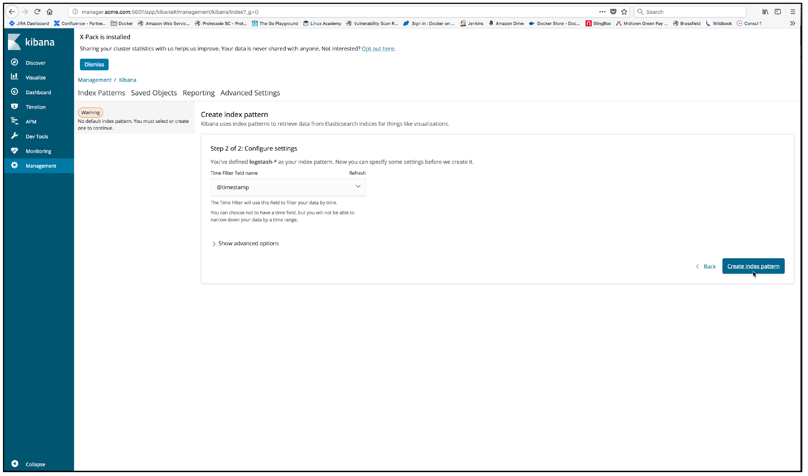

..  _elk_create_index_pattern2:

..  raw:: latex

    \newpage

Create index pattern - Step 2
=============================

You then have the option of creating a **Time filter** for the **logstash-*** index pattern. 

Select the **@timestamp** time filter and then click on the **Create index pattern** button.

..  toctree::
    :hidden:
    :titlesonly:
    :maxdepth: 1  
