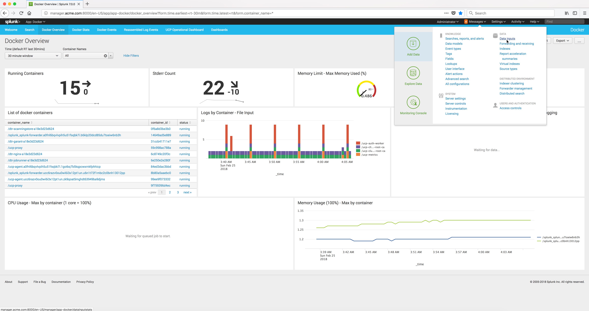

..  _splunk_create_new_http_event_collector:

Create a new HTTP Event Collector
=================================

The `Splunk Docker Logging Driver <https://docs.docker.com/config/containers/logging/splunk/>`_ will be used to send log data from a running container to the Splunk Enterprise server.

In order to do that you have to define a **HTTP Event Collector** in Splunk from the Splunk Enterprise console. 

From the Splunk Enterprise console, click on the **Settings** menu and then click on **Data Inputs** menu item.

Example Screen:

..  toctree::
    :hidden:
    :titlesonly:
    :maxdepth: 1
  
    create_new_http_event_collector1
    create_new_http_event_collector2
    create_new_http_event_collector3
    create_new_http_event_collector4
    new_http_event_collector_created
