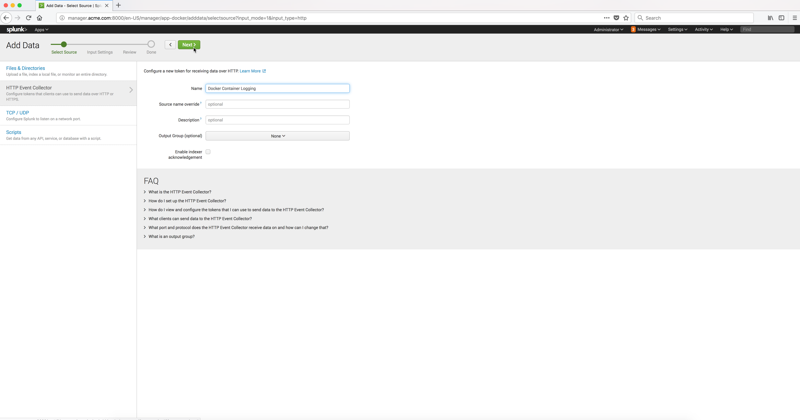

..  _splunk_create_new_http_event_collector2:

..  raw:: latex

    \newpage

Step 2
======

Enter a name for the **HTTP Event Collector**.

Click on the **Next** button.

Example Screen:

..  toctree::
    :hidden:
    :titlesonly:
    :maxdepth: 1
