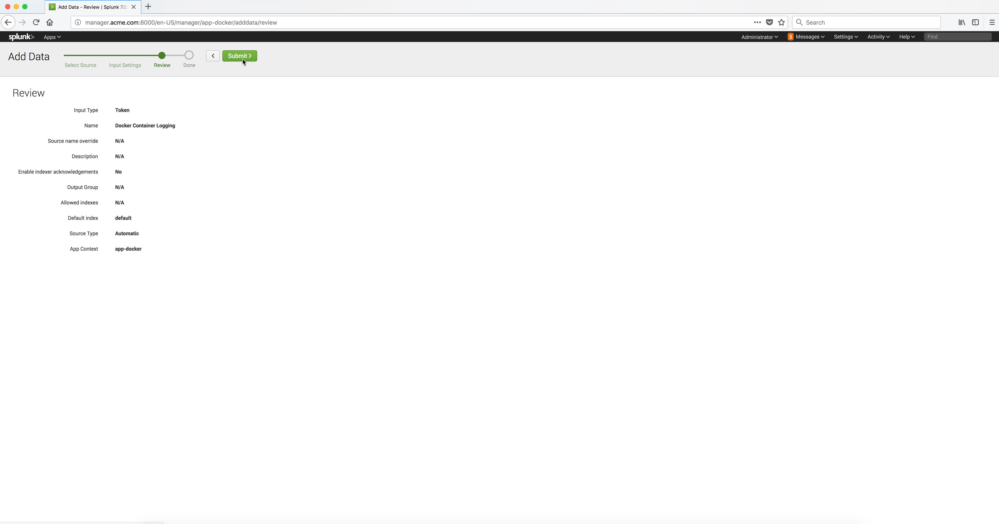

..  _splunk_create_new_http_event_collector4:

..  raw:: latex

    \newpage

Step 4
======

Click on the **Submit** button to save the new **HTTP Event Collector**.

Example Screen:

..  toctree::
    :hidden:
    :titlesonly:
    :maxdepth: 1