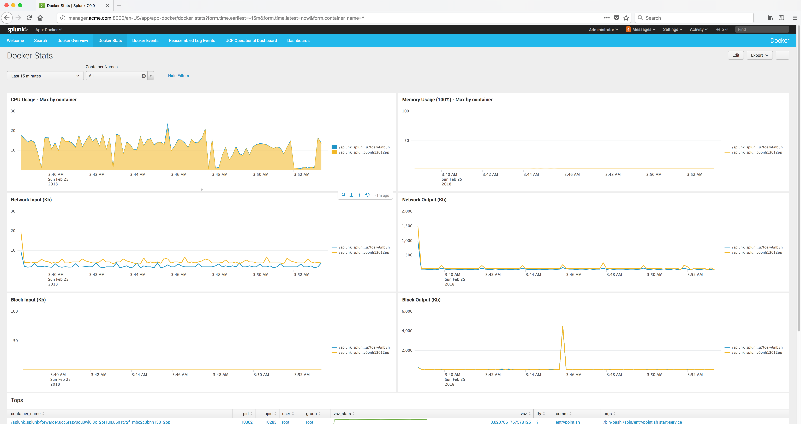

..  _splunk_docker_monitoring_stats:

..  raw:: latex

    \newpage

Docker Monitoring Stats
=======================

Click on the **Docker Stats** menu item to display the Docker Stats.

Example Screen:

..  toctree::
    :hidden:
    :titlesonly:
    :maxdepth: 1
