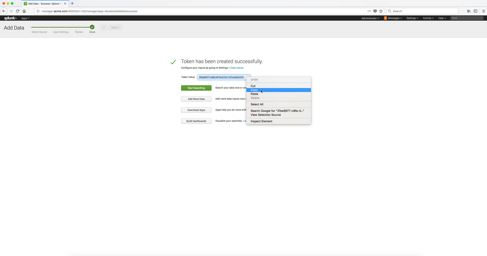

..  _splunk_new_http_event_collector_created:

..  raw:: latex

    \newpage

New HTTP Event Collector created
================================

The new **HTTP Event Collector** should now be created.    

Copy the generated **Token Value**. You will need to specify it as a log option parameter named **splunk-token** to the `Splunk Docker Logging Driver <https://docs.docker.com/config/containers/logging/splunk/>`_.

Example Screen:

..  toctree::
    :hidden:
    :titlesonly:
    :maxdepth: 1
