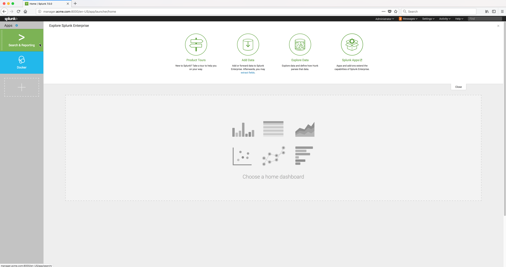

..  _splunk_view_logs:

View the Docker container log data
==================================

To view the log data from Splunk, click on the **Search & Reporting** App in the left frame of the Splunk Enterprise Console.

..  toctree::
    :hidden:
    :titlesonly:
    :maxdepth: 1

    view_logs2
    view_logs3
