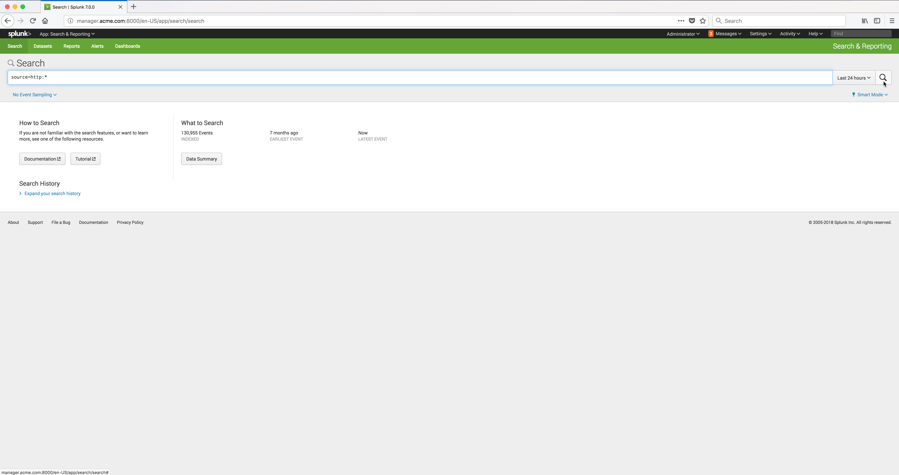

..  _splunk_view_logs2:

..  raw:: latex

    \newpage

Search for the Log data
=======================

In the Search field type in **source=http:*** and click on the search icon (magnifying glass at the far right of the Search page).

..  toctree::
    :hidden:
    :titlesonly:
    :maxdepth: 1
