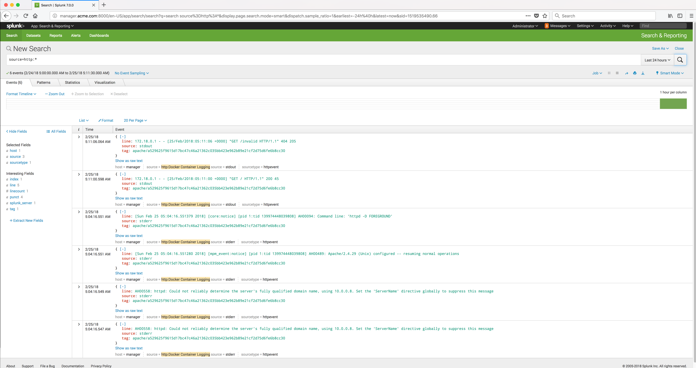

..  _splunk_view_logs2:

..  raw:: latex

    \newpage

Docker container log data
=========================

You should see the log data from the Apache HTTP Web Server container in Splunk.

..  toctree::
    :hidden:
    :titlesonly:
    :maxdepth: 1
