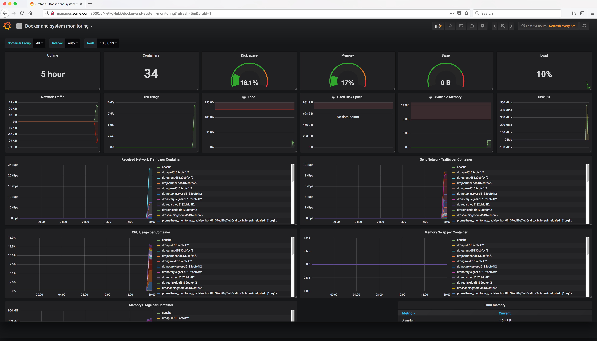

..  _grafana_prometheus_monitoring_dashboard_created:

..  raw:: latex

    \newpage

Dashboard created
=================

The dashboard will be created and displayed.  It should show metrics for all running containers in the swarm.

Example Screen:

..  toctree::
    :hidden:
    :titlesonly:
    :maxdepth: 1  
    