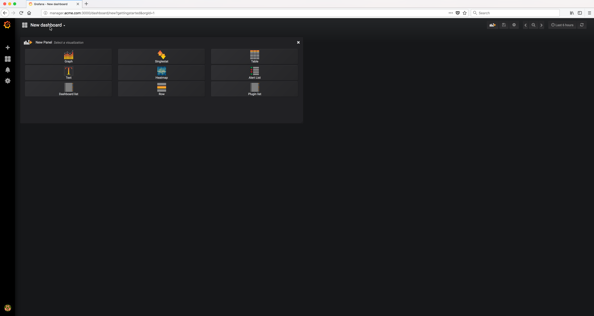
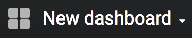

..  _grafana_prometheus_monitoring_import_dashboard1:

..  raw:: latex

    \newpage

Import a dashboard - Step 1
===========================

Click on the |new_dashboard_menu_icon| menu at the top left.

Example Screen:

..  toctree::
    :hidden:
    :titlesonly:
    :maxdepth: 1  
    