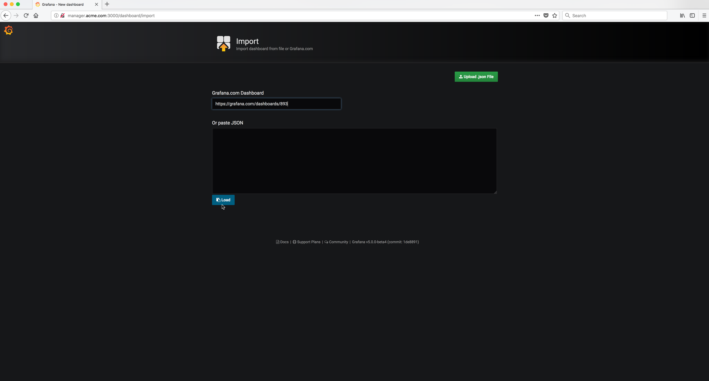
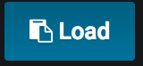

..  _grafana_prometheus_monitoring_import_dashboard3:

..  raw:: latex

    \newpage

Import a dashboard - Step 3
===========================

In the **Grafana.com Dashboard** input box paste in the URL below:

    ..  code-block:: text

        https://grafana.com/dashboards/893

Then click on the |import_dashboard_menu_item_icon| button.     

Example Screen:

..  toctree::
    :hidden:
    :titlesonly:
    :maxdepth: 1  
    