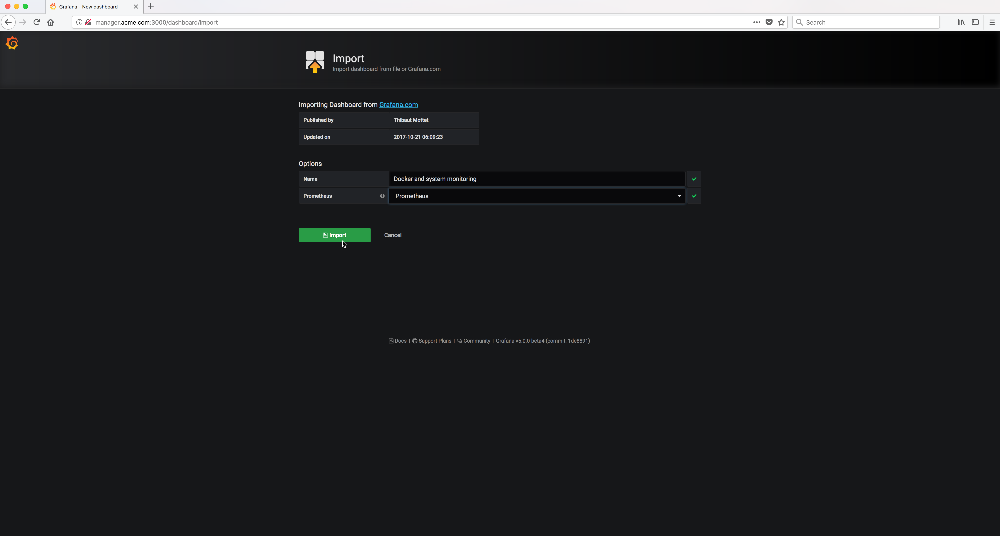
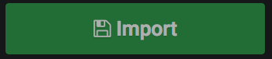

..  _grafana_prometheus_monitoring_import_dashboard4:

..  raw:: latex

    \newpage

Import a dashboard - Step 4
===========================

In the **Options** section, the **Name** will be pre-filled.

In the **Prometheus** selection box select the **Prometheus** data source.

Then click on the |import_dashboard_import_button_icon| Button.

Example Screen:

..  toctree::
    :hidden:
    :titlesonly:
    :maxdepth: 1  
    