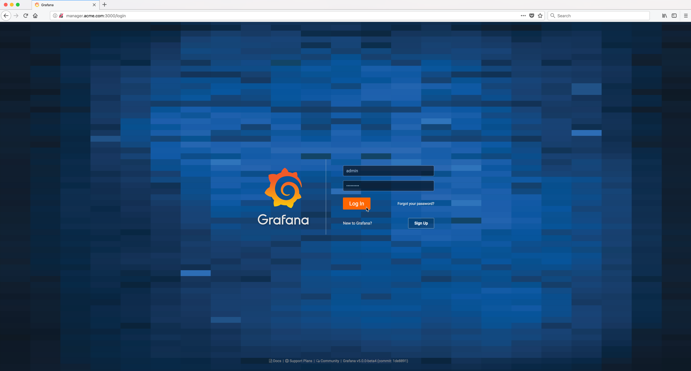

..  _grafana_prometheus_monitoring_login_to_grafana:

Login to Grafana
================

Bring up a web browser and login to the Grafana server. 

Substitute ``docker-node-name`` in the URL below with the hostname of any of the docker nodes running in the swarm.

    ``http://docker-node-name:3000``

You will be prompted for the Grafana user and password.     

The user id and password were defined as environment variables to the **monitoring_grafana** service in the :ref:`docker-compose.yml<grafana_prometheus_monitoring_docker_compose_yml>` file used to bring up the stack.

    ..  code-block:: yaml
        :emphasize-lines: 2,3

        environment:
          - GF_SECURITY_ADMIN_USER=admin
          - GF_SECURITY_ADMIN_PASSWORD=Passw0rd#

Example Screen:

..  toctree::
    :hidden:
    :titlesonly:
    :maxdepth: 1  
    