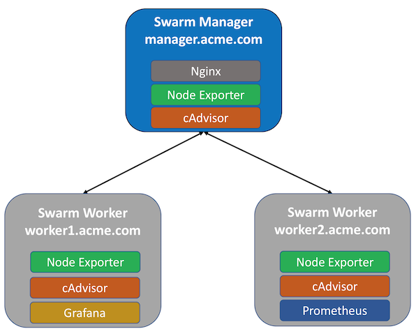

..  `_grafana_prometheus_monitoring_swarm_configuration:

Docker EE Swarm Configuration
=============================

A Grafana/Prometheus stack will be deployed to the following 3 node Docker Swarm.

..  note:: The Nginx service, Grafana service and Prometheus service can run on any node in the swarm.

..  toctree::
    :hidden:
    :titlesonly:
    :maxdepth: 1  
    
