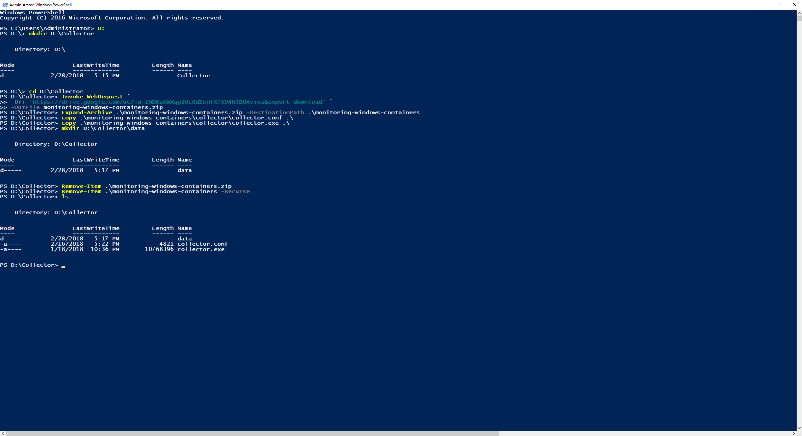

..  _splunk_install_outcold_collector1:

..  raw:: latex

    \newpage

Install the Outcold Collector
=============================

Note: In this Solutions Brief I installed Docker on the windows ``D`` drive and the Outcold Collector will be installed on the ``D`` drive. Adjust these instructions for your installation.

Install Collector
-----------------

1. Bring up a Windows Powershell Command Prompt with "Run as Administrator" authority.

    \

2. Change to the ``D`` drive.

    ..  code-block:: text

        D:

3. Create a directory on the ``D`` drive where the Outcold Collector code and configuration will be stored, and change into that directory.

    ..  code-block:: text

        mkdir D:\Collector
        cd D:\Collector

3. Download the Outcold Collector installation code (zip file) into the directory you just created. 

    ..  note:: The Outcold Collector code is not currently publicly available. Email contact@outcoldsolutions.com to get a link to the latest installation code.

    Run the following command:

    ..  code-block:: powershell

        Invoke-WebRequest `
        -Uri 'https://drive.google.com/uc?id=1NDKa8WXqp2ULQdIenfX7X94hJBUAviuz&export=download' `
        -OutFile monitoring-windows-containers.zip

4. Extract the Outcold Collector installation code (zip file).

    ..  code-block:: powershell

        Expand-Archive .\monitoring-windows-containers.zip -DestinationPath .\monitoring-windows-containers

5. Copy the file **collector.conf** from the extracted Outcold install code directory to the directory you just created.

    ..  code-block:: powershell

        copy .\monitoring-windows-containers\collector\collector.conf .\

5. Copy the file **collector.exe** from the extracted Outcold install code directory to the directory you just created.

    ..  code-block:: powershell

        copy .\monitoring-windows-containers\collector\collector.exe .\

6. Now create a directory inside the **Collector** directory to hold the Outcold Collector database.

    ..  code-block:: text

        mkdir D:\Collector\data      

7. You can now remove the file **monitoring-windows-containers.zip** and the directory **monitoring-windows-containers** to save disk space.

    ..  code-block:: powershell

        Remove-Item .\monitoring-windows-containers.zip     
        Remove-Item .\monitoring-windows-containers -Recurse     

8. List the contents of the Collector directory with the ls command.

    ..  code-block:: powershell

        ls

    Example Output:

    ..  code-block:: text

            Directory: D:\Collector

        Mode                LastWriteTime         Length Name
        ----                -------------         ------ ----
        d-----        2/28/2018   5:37 PM                data
        -a----        2/28/2018   5:35 PM           4849 collector.conf
        -a----        1/18/2018  10:36 PM       10768396 collector.exe
             
..  raw:: latex

    \newpage

Example Screen:

..  toctree::
    :hidden:
    :titlesonly:
    :maxdepth: 1
