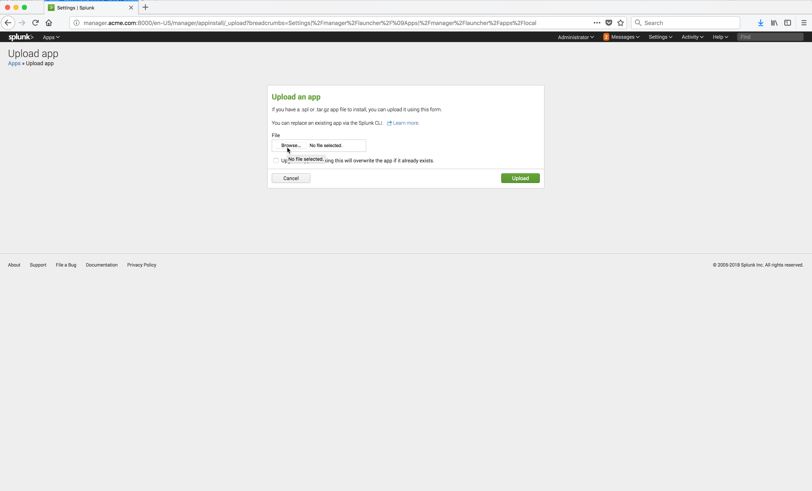

..  _splunk_install_splunk_monitoring_windows_app2:

..  raw:: latex

    \newpage

Install App - Step 2
====================

Click on the **Browse** button and locate and select the downloaded Splunk Monitoring Windows Container App code.

The file name should look something link this ``monitoring-windows-containers-metrics-and-logs-forwarding_2121.tgz``.

Example Screen:

..  toctree::
    :hidden:
    :titlesonly:
    :maxdepth: 1
