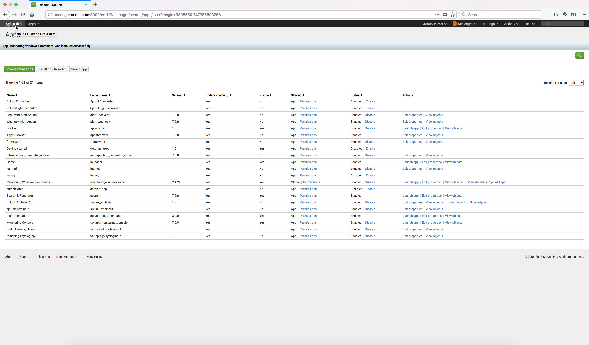

..  _splunk_app_code_installed:

..  raw:: latex

    \newpage

App installed
=============

The Splunk Monitoring Windows Container App should now be installed.

Click on the |splunk_home_button_icon| Home button at the top left corner.

Example Screen:

..  toctree::
    :hidden:
    :titlesonly:
    :maxdepth: 1
    