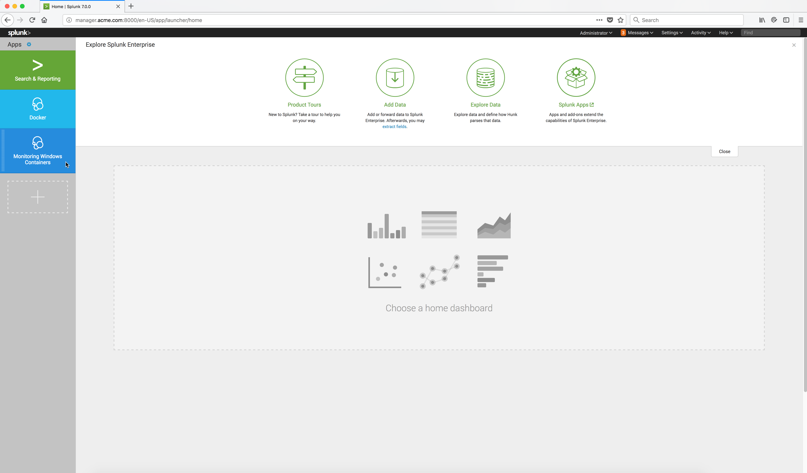

..  _splunk_launch_splunk_app:

..  raw:: latex

    \newpage

Launch Monitoring Windows Containers App
========================================
The Splunk **Monitoring Windows Containers** App should now appear on the Splunk Home page in the left frame.

Click on the **Monitoring Windows Containers** App to launch it.

Example Screen:

..  toctree::
    :hidden:
    :titlesonly:
    :maxdepth: 1
