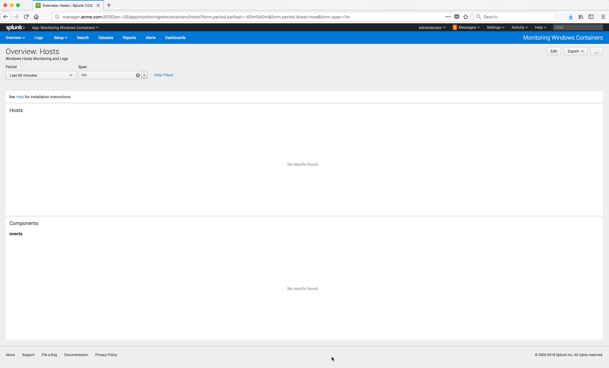

..  _splunk_launch_splunk_app:

..  raw:: latex

    \newpage

App Dashboard
=============

The Splunk Monitoring Windows Containers App **Overview: Hosts** page should now appear.

This page shows all Docker Windows nodes that are running the Outcold Collector and have connected to this Splunk Enterprise server.

It will not contain any data yet. You need to :ref:`install the Outcold Collector<splunk_install_outcold_collector>` and configure it on a Docker Windows node.

Example Screen:

..  toctree::
    :hidden:
    :titlesonly:
    :maxdepth: 1
