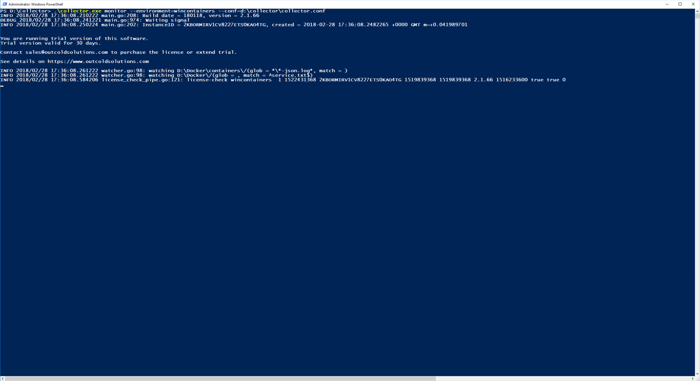

..  _splunk_start_outcold_collector:

..  raw:: latex

    \newpage

Start the Collector
===================

Start the Outcold Collector manually to test it and look for errors. Issue the command below from a Windows Powershell command prompt on the Docker Windows node and look for any errors.

..  code-block:: text

    .\collector.exe monitor --environment=wincontainers --conf=d:\collector\collector.conf

Example Screen:

..  toctree::
    :hidden:
    :titlesonly:
    :maxdepth: 1
      