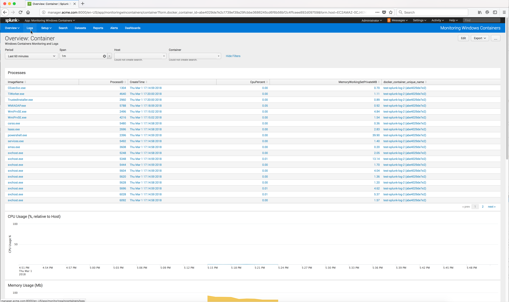

..  _splunk_view_windows_containers_logs1:

View the Windows Containers Logs
================================

Windows container logs are automatically captured by the Outcold Collector and sent to the Splunk Enterprise Search Head server. 

The Windows containers do not have to explicitly use the Splunk logging driver.

From the Splunk Enterprise console, click on the App Monitoring Windows Containers **Logs** menu.

..  toctree::
    :hidden:
    :titlesonly:
    :maxdepth: 1

    view_windows_containers_logs1
    view_windows_containers_logs2