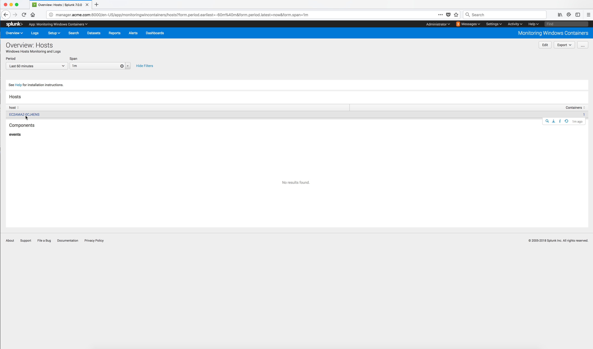

..  _splunk_view_windows_containers_metrics1:

View the Windows Containers Metrics
===================================

To generate some data I started 2 Windows containers on the Docker Windows node where the Collector was installed. 

You can run the following command to start a Docker Windows Container named **test-splunk-log** from a Powershell command prompt on the Docker Windows node:

    .. code-block:: text

        docker container run -it -d --rm --name test-splunk-log microsoft/nanoserver:latest `
        Powershell 'Get-CimInstance Win32_OperatingSystem | FL * ; Start-Sleep -seconds 600'

Refresh the App Monitoring Windows Containers **Overview: Hosts** screen from the Splunk Enterprise server console.

You should now see a host which is the Docker Windows node where the Outcold Collector was installed and running.

..  note:: There might be a slight delay (20-30 seconds) before the data is available for display.

Click on the host (Docker Windows node).

..  toctree::
    :hidden:
    :titlesonly:
    :maxdepth: 1

    view_windows_containers_metrics1
    view_windows_containers_metrics2
